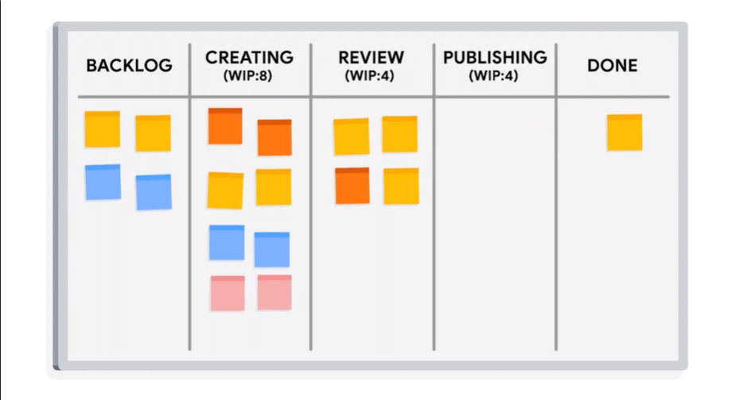
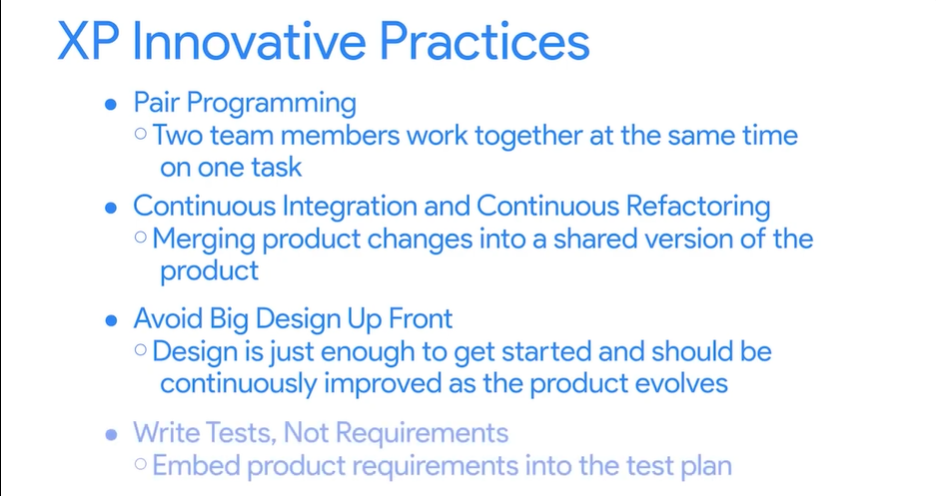
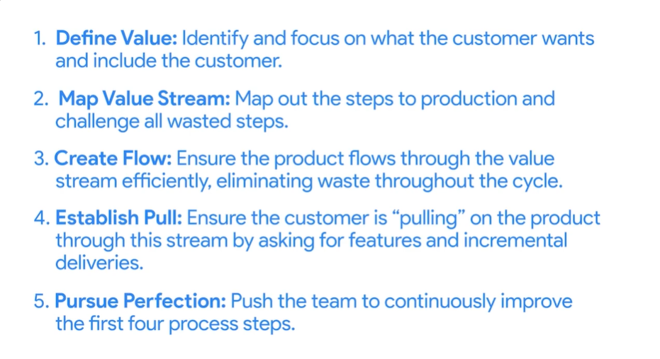

# Other Common Agile Methodologies

## Kanban

The name Kanban comes from two Japanese words: "Kan" meaning sign, and "Ban" meaning a board.

Kanban boards or charts display the progress of a project as:

- To Do
- In Progress
- Done

### WIP (Work in Progress) limit

The Kanban method ensures that the project team only accepts a sustainable amount of "In Progress" work.

### Flow

Once a task has started, it becomes a priority for the whole team to get it to "done". By focusing on less work, the work gets done faster. This goal of maximizing efficiency is called **flow**, and it is a core principle of Kanban.

## XP (Extreme Programming)

Prioritizes technical excellence with practices like test-driven development (TDD), pair programming, and frequent releases.

## Lean

Inspired by lean manufacturing, it emphasizes eliminating waste, optimizing efficiency, and delivering value quickly.

See [Agile Methodology](agile-methodology.md) for the other methods (FDD, DSDM, Crystal).

## Practice Questions

??? question "1. What does Kanban mean, and how does a Kanban board show progress?"

    Kan means sign and Ban means board. The board shows work as To Do, In Progress, and Done.

??? question "2. What is a WIP limit?"

    A limit that ensures the team only accepts a sustainable amount of In Progress work.

??? question "3. What is flow in Kanban?"

    Once a task is started, getting it to done becomes the whole team's priority. By focusing on less work, work gets done faster. Maximizing efficiency this way is called flow.

??? question "4. What practices does XP prioritize?"

    Technical excellence: test-driven development (TDD), pair programming, and frequent releases.
