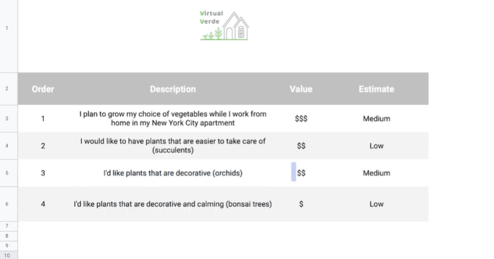

# How to Build a Scrum Product Backlog

## Three key features of Product Backlog

1. Living artifact → items can be added anytime
2. Owned and adjusted by the Product Owner
3. Prioritized list of features → new features are added in order of importance [ Top (well defined Items), Bottom (vague items) ]

## Practice Questions

??? question "1. What are the three key features of a product backlog?"

    It is a living artifact (items can be added anytime), owned and adjusted by the Product Owner, and a prioritized list of features.

??? question "2. How is the backlog ordered?"

    New features are added in order of importance: well-defined items at the top and vague items at the bottom.

??? question "3. What columns does the example backlog use?"

    Order, Description, Value, and Estimate.
