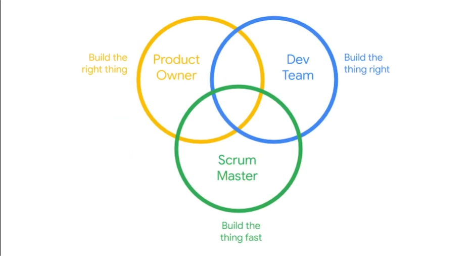

# Scrum Roles and Team Responsibilities

## Mission

Why we are doing the work

A mission is a short statement that stays constant for your team throughout the process, and gives them something to work toward.

## Vision

What the work will look like when we’re done

A product vision is, making it clear what outcomes the team is responsible for and where your team’s boundaries are.

## Scrum Roles:

## Practice Questions

??? question "1. What is the mission?"

    Why we are doing the work: a short statement that stays constant for the team throughout the process and gives them something to work toward.

??? question "2. What is the vision?"

    What the work will look like when we're done: it makes clear what outcomes the team is responsible for and where the team's boundaries are.

??? question "3. What does each Scrum role focus on?"

    The Product Owner builds the right thing, the Dev Team builds the thing right, and the Scrum Master helps build the thing fast.
