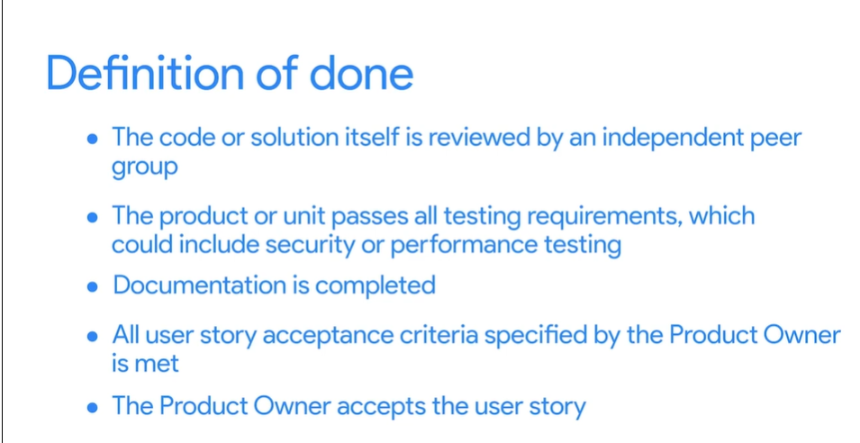

# How to Plan a Scrum Sprint

The entire Scrum Team comes together and confirm how much time and people are available during Sprint. 
And Identify what items from the backlog will be done during the Sprint..

Questions a Scrum Master Should ask:

- Who is available during this Sprint? Are there any vacations or conflicts that we should know about?
- What has been our average velocity?
- What can and should be accomplished by the team in this upcoming sprint?
- What is the ultimate sprint goal?
- How will the work get done?
- Throughout the sprint, who is responsible for what tasks?

## Practice Questions

??? question "1. What happens in sprint planning?"

    The whole Scrum team confirms how much time and how many people are available, and identifies which backlog items will be done during the sprint.

??? question "2. What questions should a Scrum Master ask?"

    Who is available, what has been our average velocity, what can and should be accomplished, what is the sprint goal, how will the work get done, and who is responsible for which tasks.

??? question "3. What does the definition of done in the image include?"

    Independent peer review of the code or solution, all testing requirements passed (possibly security or performance), documentation completed, all acceptance criteria from the Product Owner met, and the Product Owner accepts the user story.
