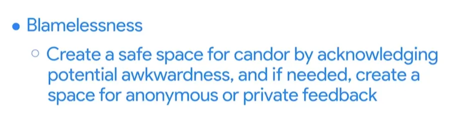
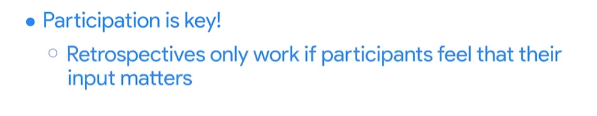
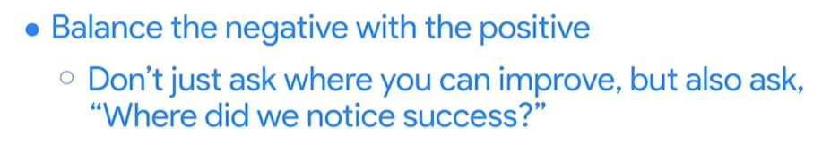
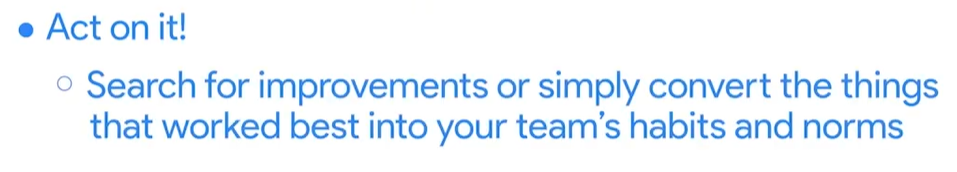

# The Art of the Scrum Sprint Retrospective

Up to 3 hours.

The team reflects on:

- What is working or not working for the team regarding the people, the processes, and the tools?
- What improvements are worth exploring in the next sprint?
- What improvements were put in place for the last sprint? Were they helpful or not, and why?

## Key measures

The course shows key measures for the retrospective as diagrams.

## Practice Questions

??? question "1. How long can a Sprint Retrospective last?"

    Up to 3 hours.

??? question "2. What does the team reflect on in a retrospective?"

    What is working or not working regarding people, processes, and tools; which improvements are worth exploring in the next sprint; and whether the improvements from the last sprint were helpful, and why.
