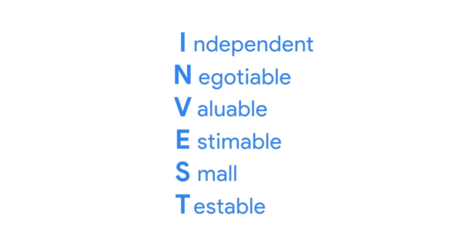

# How to Write User Stories

## Six criteria each user story  should meet

## Epic

A group or collection of User Stories

Example:

- Vendor Management
- Plant Delivery
- CLient Data Management

## Practice Questions

??? question "1. What does INVEST stand for?"

    Independent, Negotiable, Valuable, Estimable, Small, Testable: the six criteria each user story should meet.

??? question "2. What is an epic?"

    A group or collection of user stories, for example Vendor Management, Plant Delivery, or Client Data Management.
