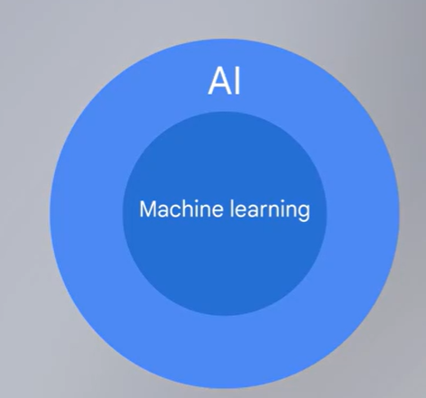

# How AI Uses Machine Learning

AI is powered by Machine Learning (ML)

Machine Learning → is a subset of AI focused on developing computer programs that can analyze data to make decisions or predictions

AI designers build ML programs using a training set.

The quality and relevance of their training data matter. 

Bias → can cause inaccurate or unintended results

## Practice Questions

??? question "1. What is the relationship between AI and machine learning?"

    AI is powered by machine learning, a subset of AI focused on developing programs that analyze data to make decisions or predictions.

??? question "2. Why does the training data matter?"

    The quality and relevance of the data determines the results. Bias in the data can cause inaccurate or unintended results.
