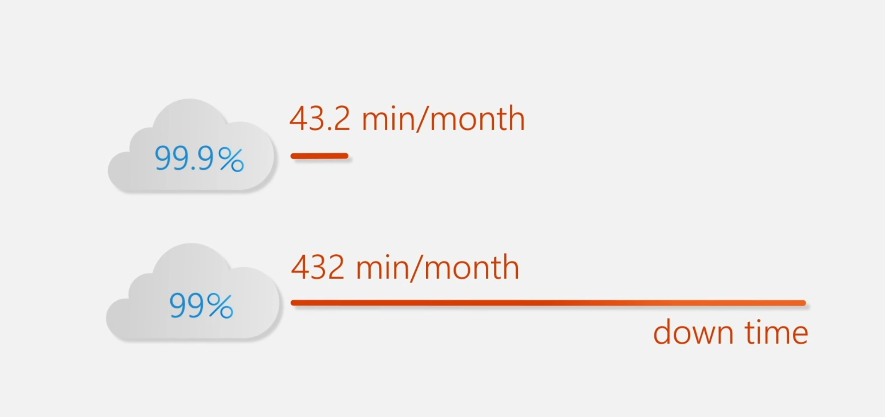

# Benefits of Using Cloud Services

## High availability and scalability

### High availability

The availability of applications, services, and any IT resources or infrastructure regardless of disruptions or events.

**SLAs (Service Level Agreements)** guarantee that Azure is available for a specific service, with a percentage of uptime.

### Scalability

The ability of a system to handle growth of users or work (traffic).

- **Vertical scaling (scale up/down):** "make one machine powerful". Increase the processing power by adding more CPUs or RAM to the VM.
- **Horizontal scaling (scale out/in):** "add more of the same machines".

**Automated vs manual**

- **Manual:** you click in the portal or run a script to scale up/down or out/in.
- **Auto:** you set rules ("if CPU > 70% for 5 minutes, add one VM"; "if requests < 10/sec, remove one machine") so the cloud adjusts itself in real time.

### Vertical vs horizontal

- **Concurrency and throughput.** Vertical: one machine can crunch bigger jobs (like large in-memory database queries), but it is still one machine, so if 100 users hit it simultaneously they queue on that one box. Horizontal: many machines share the work, so 100 users can be spread across 5 or 10 servers at once. Great for web-scale, stateless workloads.
- **Fault tolerance.** Vertical: if your single, supersized VM dies, your app is down until it is back up. Horizontal: one instance can fail and traffic reroutes to the remaining healthy nodes.
- **Limits and cost.** Vertical: you are capped by the vendor's max VM size (for example 64 vCPU/256 GB RAM), and bigger VMs cost more per hour even if you don't use all the power. Horizontal: you can keep adding small or medium instances as long as you stay within your subscription quota, and you pay only for the instances you need for as long as you need them.
- **Downtime and complexity.** Vertical: often a brief outage while the VM resizes, with simpler network configuration (one IP, one host). Horizontal: zero downtime if you use a load balancer, but you must manage instance counts, health probes, and sticky sessions.

### Elasticity

Your system's ability to **automatically** match resources to **real-time** demand, spinning them up when you need them and tearing them down when you don't. You never pay for idle capacity, nor get overwhelmed by sudden spikes.

### Agility

The speed and ease of allocating and deallocating resources.

## Reliability and predictability

- **Reliability:** the ability of a system to recover from failures and continue to function.
- **Predictability:** a solution whose cost and performance are predictable.
    - **Performance:** predicting the resources needed to deliver a positive experience for your customers. Autoscaling, load balancing, and high availability support performance predictability.
    - **Cost:** predicting or forecasting the cost of the cloud spend.

## Security and governance

### Security

- Protection of customer **data** (access control, encryption)
- Protection of cloud **applications**
- Protection of cloud **infrastructure**

!!! tip
    All models have built-in DDoS protection from Azure DDoS.

??? note "Role-Based Access Control (RBAC) and least privilege"

    **Why it matters:** if every engineer gets subscription-owner rights, a simple mistake can take down production.

    **Cloud in action:** define roles ("Network admin", "App deployer", "Security reader") and assign them to people or teams. They can only do exactly what they need.

    **Benefit:** locks down the blast radius. People can never wander into areas they shouldn't touch.

??? note "Built-in DDoS protection and network security"

    **Why it matters:** internet-facing apps face botnets, DDoS attacks, and random port scans 24/7.

    **Cloud in action:** Azure DDoS Protection (standard) sits at the network edge, automatically absorbing traffic floods. Combine it with Network Security Groups and Azure Firewall to filter out malicious packets.

    **Benefit:** your apps stay online under attack, while the bad traffic gets black-holed.

??? note "Automated patching and updates"

    **Why it matters:** missing a critical OS patch can let attackers slip in, and manually tracking hundreds of VMs is a nightmare.

    **Cloud in action:** with IaaS you opt into Azure Update Manager, which schedules and rolls out Windows/Linux patches across your fleet. With PaaS and SaaS, Microsoft handles patching for you.

    **Benefit:** fewer vulnerabilities, less operational overhead, and more time to build features.

### Governance

A set of rules and policies that guide an organization's cloud operations and provide a guardrail that ensures we are as secure, consistent, and efficient as possible. It has **deployment templates** to make sure deployed resources meet corporate standards and regulatory requirements.

??? note "Consistency through policies and templates"

    **Why it matters:** without rules, everyone names resources differently, forgets tags, or opens things to the internet by accident.

    **Cloud in action:** you write an Azure Policy that says "all storage accounts must enforce HTTPS and be in West US". Every time someone deploys a storage account, Azure automatically checks compliance and even blocks non-compliant ones.

    **Benefit:** uniformity at scale. No rogue VMs or data stores slipping through the cracks.

??? note "Auditability and compliance"

    **Why it matters:** industries like finance or healthcare have legal rules (PCI-DSS, HIPAA, GDPR), and you need proof you followed them.

    **Cloud in action:** Azure Policy and Azure Security Center continuously scan your subscriptions. If a resource drifts out of compliance (for example a VM missing its required encryption), they flag it, show you exactly where, and often suggest a one-click fix.

    **Benefit:** instant visibility into your risk posture and a clear audit trail for regulators.

## Manageability

**What?**

- Automatically scale resource deployment based on need.
- Deploy resources based on a preconfigured template, removing the need for manual configuration.
- Monitor the health of resources and automatically replace failing resources.
- Receive automatic alerts based on configured metrics, so you are aware of performance in real time.

**How?**

- Through a web portal.
- Using a command line interface.
- Using APIs.
- Using PowerShell.

## Practice Questions

??? question "1. What is an SLA?"

    A Service Level Agreement: a guarantee that Azure is available for a specific service with a stated percentage of uptime.

??? question "2. What is the difference between vertical and horizontal scaling?"

    Vertical scaling makes one machine more powerful (more CPU or RAM). Horizontal scaling adds more of the same machines. Horizontal gives better fault tolerance and can avoid downtime with a load balancer, while vertical is limited by the maximum VM size.

??? question "3. What is elasticity?"

    The ability to automatically match resources to real-time demand, spinning them up when needed and tearing them down when not, so you never pay for idle capacity or get overwhelmed by spikes.

??? question "4. What is the difference between reliability and predictability?"

    Reliability is the ability to recover from failures and keep functioning. Predictability is having predictable cost and performance.

??? question "5. What are RBAC and least privilege?"

    Roles such as Network admin or Security reader are assigned to people or teams so they can only do exactly what they need, which limits the blast radius of mistakes.

??? question "6. What is governance in the cloud?"

    Rules and policies (like Azure Policy and deployment templates) that guide cloud operations and act as a guardrail so resources are secure, consistent, efficient, and compliant.

??? question "7. How can you manage cloud resources?"

    Through a web portal, a command line interface, APIs, or PowerShell.
