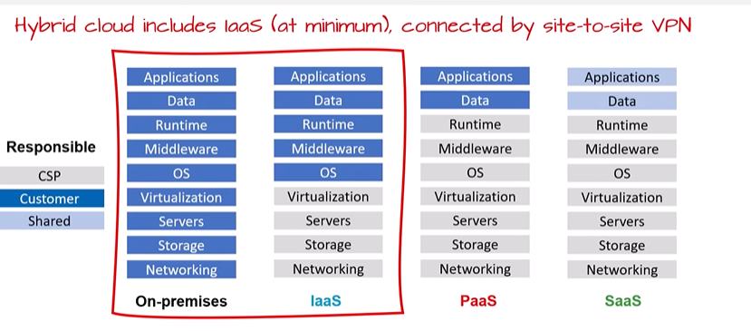

# Cloud Service Types

## Infrastructure as a Service (IaaS)

With IaaS you are essentially renting the hardware in a cloud datacenter, but what you do with that hardware is up to you.

### Use cases

- **Testing and development:** teams can easily deploy and then delete VMs when they no longer need them.
- **Running applications in the cloud:** the application might need to handle fluctuations in demand.
- **Disaster recovery:** use Azure Site Recovery to replicate VMs to Azure and enable push-button, automated VM spin-up and shutdown.
- **Hybrid:** extend the capability of on-premises infrastructure.

### Examples (you manage the OS and above)

- AWS EC2 (virtual machines), Amazon EBS (block storage)
- Google Compute Engine (GCE)
- Microsoft Azure Virtual Machines
- DigitalOcean Droplets

Typical use case: lift-and-shift VMs, custom OS-level configs, running your own hypervisor or container hosts.

## Platform as a Service (PaaS)

The cloud provider is responsible for maintaining the physical infrastructure, its access to the internet, the operating systems, databases, and development tools.

Think of PaaS like using a domain-joined machine: IT maintains the device with regular updates, patches, and refreshes.

### Use cases

- **Development framework:** PaaS provides a framework developers can build upon to develop or customize cloud-based applications. Similar to creating an Excel macro, PaaS lets developers create applications using built-in software components. Cloud features such as scalability, high availability, and multi-tenant capability are included, reducing the amount of coding developers must do.
- **Analytics or business intelligence:** tools provided as a service allow organizations to analyze and mine their data, finding insights and patterns and predicting outcomes to improve forecasting, product design decisions, investment returns, and other business decisions.

### Examples (you manage app code; the provider manages the platform)

- Heroku (`git push`, app runs)
- Google App Engine (standard and flexible)
- AWS Elastic Beanstalk
- Azure App Service
- Red Hat OpenShift (managed platform)

Typical use case: web apps where you want simple deployment, autoscaling, and less ops overhead.

## Software as a Service (SaaS)

It requires the least amount of technical knowledge or expertise to fully employ.

In a SaaS environment you are responsible for the **data** you put into the system, the **devices** you allow to connect to the system, and the **users** that have access.

### Use cases

- Email and messaging
- Business productivity applications
- Finance and expense tracking

### Examples (the provider manages the app; you use it)

- Google Workspace (Gmail, Docs)
- Salesforce (CRM)
- Slack / Microsoft Teams (collaboration)
- Dropbox, Zoom, GitHub (hosted service)

Typical use case: end-user applications and business tools with no infrastructure work required.

## Practice Questions

??? question "1. What do you rent with IaaS, and what do you manage?"

    You rent the hardware in a cloud datacenter (for example virtual machines). You manage the operating system and everything above it.

??? question "2. What does the provider manage in PaaS?"

    The physical infrastructure, its internet access, the operating systems, databases, and development tools. You manage your app code.

??? question "3. What are you responsible for in SaaS?"

    The data you put into the system, the devices you allow to connect, and the users that have access.

??? question "4. Give one example each of IaaS, PaaS, and SaaS."

    IaaS: Azure Virtual Machines (or AWS EC2). PaaS: Azure App Service (or Heroku). SaaS: Google Workspace (or Salesforce, Slack).

??? question "5. What are typical use cases for IaaS?"

    Testing and development, running applications with fluctuating demand, disaster recovery with Azure Site Recovery, and hybrid extension of on-premises capability.
