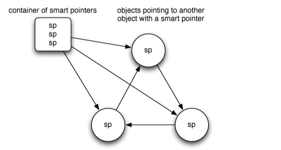
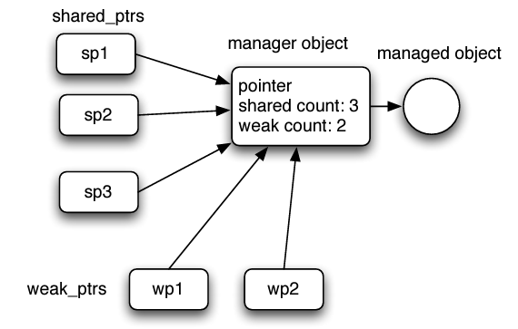

# Smart Pointers

> "Ensure resources are owned by objects. Use explicit [RAII](raii.md) and smart pointers."
> — Sutter, Alexandrescu (2005)

## What is a smart pointer?

A smart pointer is an RAII-modeled class that manages dynamically allocated memory. It provides all the interfaces of a normal pointer, with a few exceptions. During construction it owns the memory, and it releases the memory when it goes out of scope. That frees the programmer from managing dynamically allocated memory by hand.

## The normal way (raw pointers)

```cpp
#include <iostream>

void allocateAndUseMemory() {
    // Dynamically allocate memory for an integer
    int* ptr = new int;

    // Assign a value to the allocated memory
    *ptr = 42;

    // Use the allocated memory (just printing the value)
    std::cout << "Value: " << *ptr << std::endl;

    // Manual memory deallocation is required here
    delete ptr; // Without this line, memory will be leaked!
}

int main() {
    allocateAndUseMemory(); // Calling the function that uses dynamic memory
    return 0;
}
```

## Using a custom wrapper class

```cpp
#include <iostream>

// Template SmartPtr class that automatically handles memory management
template <typename T>
class SmartPtr {
private:
    T* ptr; // Raw pointer to the resource (e.g., int)

public:

    explicit SmartPtr(T* p = nullptr) : ptr(p) {}

    // Destructor: Automatically delete the pointer when the object goes out of scope
    ~SmartPtr() {
        delete ptr;
    }

    T& operator*() {
        return *ptr;
    }

    T* operator->() {
        return ptr;
    }

    SmartPtr(const SmartPtr& other) = delete;
    SmartPtr& operator=(const SmartPtr& other) = delete;
};

void allocateAndUseMemory() {

    SmartPtr<int> ptr(new int); // cannot write SmartPtr<int> ptr = new int;
    // explanation:
    // SmartPtr<int> ptr = new int;  // Error: no matching constructor (explicit prevents this)
    *ptr = 42;

    std::cout << "Value: " << *ptr << std::endl;

    // No need to manually call delete! Memory will be cleaned up automatically
}

int main() {
    allocateAndUseMemory();
    return 0;
}
```

??? note "Why use explicit?"

    1. **Prevent unintended implicit conversions.** Sometimes you might accidentally pass an argument that can be implicitly converted to a type, leading to subtle bugs. `explicit` helps avoid this.
    2. **Clearer code.** It forces the user of the class to state their intent when calling the constructor, making the code easier to understand and maintain.

## Exclusive ownership with `std::unique_ptr`

- A `std::unique_ptr` is a smart pointer that **owns** a resource **exclusively**. It is the **only** pointer with control over the resource. No other pointer can share ownership of it at the same time.
- It manages the dynamically allocated memory, so we no longer delete it manually. The pointer cleans up automatically when it goes out of scope.

```cpp
#include <iostream>
#include <memory>  // For std::unique_ptr

void allocateAndUseMemory() {
    std::unique_ptr<int> ptr(std::make_unique<int>()); // C++14
    // OR
    // std::unique_ptr<int> ptr(new int);

    // Assign a value to the allocated memory
    *ptr = 42;

    // Use the allocated memory (just printing the value)
    std::cout << "Value: " << *ptr << std::endl;

    // No need for manual memory deallocation; it's handled by unique_ptr automatically
    // When ptr goes out of scope, the memory will be freed.
}

int main() {
    allocateAndUseMemory(); // Calling the function that uses dynamic memory
    return 0;
}
```

??? note "std::make_unique (C++14)"

    `std::make_unique` is **exception-safe**. If there is an error while constructing the object (for example, the constructor throws), the memory is automatically cleaned up by the `std::unique_ptr`. If you use `new` directly, it is still safe in terms of deallocation because `std::unique_ptr` calls `delete` when it goes out of scope, but it is less concise and less in line with modern C++.

    In modern C++, `std::make_unique` is encouraged because:

    - It prevents some pitfalls of raw pointers.
    - It prevents accidentally forgetting to `delete` or mismanaging memory.
    - It clearly signals the ownership model and intent: this pointer uniquely owns the object, and ownership transfers automatically.

## Shared ownership with `std::shared_ptr`

- A `std::shared_ptr` **shares** ownership of a resource with other `shared_ptr` objects. Multiple `shared_ptr` objects can point to the same resource, and the resource is destroyed only when **all** of them go out of scope.
- It uses **reference counting** to track how many `shared_ptr` objects point to the resource. When the last one goes out of scope, the resource is automatically deleted.

```cpp
#include <iostream>
#include <memory>  // For std::shared_ptr

void allocateAndUseMemory() {
    // Create a shared_ptr that automatically manages the dynamically allocated memory
    std::shared_ptr<int> ptr1(std::make_shared<int>());

    *ptr1 = 42;

    std::cout << "Value: " << *ptr1 << std::endl;

    // Create another shared_ptr that shares ownership of the same memory
    std::shared_ptr<int> ptr2 = ptr1;

    // Both ptr1 and ptr2 now share ownership of the same memory
    std::cout << "Value (from ptr2): " << *ptr2 << std::endl;

    // No need for manual memory deallocation; it's handled by shared_ptr automatically
    // The memory will be freed when the last shared_ptr goes out of scope.
}

int main() {
    allocateAndUseMemory();
    return 0;
}
```

## The cycle problem

A problem with `std::shared_ptr` arises when two or more objects point to each other using `shared_ptr`, creating a **cycle**. Even if no external pointer references the objects, each object's reference count never reaches zero because they keep each other alive.




```cpp
#include <memory>

struct Node {
    std::shared_ptr<Node> next;
};

int main() {
    auto node1 = std::make_shared<Node>();
    auto node2 = std::make_shared<Node>();

    node1->next = node2;
    node2->next = node1;  // Creates a cycle

    // Neither node1 nor node2 will be deleted because their reference count is never zero
}
```

To solve the cycle problem, C++11 introduced `std::weak_ptr`.

### Solution: `std::weak_ptr`

A `weak_ptr` **observes** the object managed by a `shared_ptr` but **does not** affect its lifetime. It can break cycles by referring to objects without keeping them alive. It does not increment the reference count. It can be converted to a `shared_ptr` using `lock()`, which checks whether the object is still alive.

```cpp
#include <memory>

struct Node {
    std::weak_ptr<Node> next;
};

int main() {
    auto node1 = std::make_shared<Node>();
    auto node2 = std::make_shared<Node>();

    node1->next = node2;  // weak_ptr does not affect reference count
    node2->next = node1;  // weak_ptr does not affect reference count

    // When the shared_ptrs go out of scope, node1 and node2 will be deleted
}
```

??? note "How shared_ptr and weak_ptr are implemented"

    **Key components**

    1. **Managed object**: the dynamically allocated object being pointed to.
    2. **Manager object**: a separate dynamically allocated structure that contains:
        - a pointer to the managed object,
        - a **shared count**: the number of `shared_ptr` instances pointing to the manager object,
        - a **weak count**: the number of `weak_ptr` instances pointing to the manager object.




    **How it works**

    1. **Creating a shared_ptr.** When a `shared_ptr` (say `sp1`) is created for a newly allocated object, a manager object is also allocated. It holds a pointer to the managed object, with the shared count at 1 and the weak count at 0.
    2. **Copying a shared_ptr.** A new `shared_ptr` (`sp2`) created by copy or assignment from `sp1` points to the same manager object, and the shared count is incremented.
    3. **Creating a weak_ptr.** A `weak_ptr` (`wp1`) created from a `shared_ptr` or another `weak_ptr` points to the same manager object, and the weak count is incremented.
    4. **Destroying a shared_ptr.** Its destructor decrements the shared count. If the shared count reaches 0, the managed object is deleted. The manager object is kept as long as the weak count is above 0, so remaining `weak_ptr` instances stay valid.
    5. **Destroying a weak_ptr.** Its destructor decrements the weak count. If both the shared and weak counts reach 0, the manager object is deleted.

## Practice Questions

??? question "1. What problem do smart pointers solve compared with raw new and delete?"

    With raw pointers you must remember to `delete` the memory, and forgetting leaks it. A smart pointer is an RAII class: it owns the memory when constructed and releases it when it goes out of scope, so manual deallocation is not needed.

??? question "2. What is the difference between unique_ptr and shared_ptr?"

    `unique_ptr` owns a resource **exclusively**: it is the only pointer in control of it. `shared_ptr` **shares** ownership with other `shared_ptr` objects using reference counting, and the resource is destroyed only when the last one goes out of scope.

??? question "3. What is the cycle problem with shared_ptr?"

    If two objects hold `shared_ptr`s to each other, each keeps the other's reference count above zero, even when nothing else refers to them. Neither is ever deleted, so the memory leaks.

??? question "4. How does weak_ptr fix it?"

    A `weak_ptr` observes an object owned by `shared_ptr`s without incrementing the reference count, so it does not keep the object alive. Using `weak_ptr` for one direction of the link breaks the cycle. To use the object, call `lock()`, which returns a `shared_ptr` if the object is still alive.

??? question "5. Why is the SmartPtr constructor marked explicit?"

    To prevent unintended implicit conversions and to make the caller state their intent. That is why `SmartPtr<int> ptr = new int;` is an error and you must write `SmartPtr<int> ptr(new int);`.

??? question "6. Why is std::make_unique preferred over new?"

    It is exception-safe, more concise, avoids raw pointer pitfalls like forgetting to delete, and clearly signals that the pointer uniquely owns the object.
