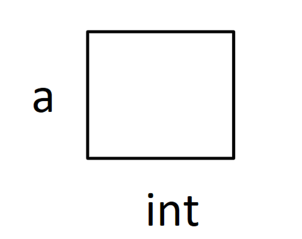
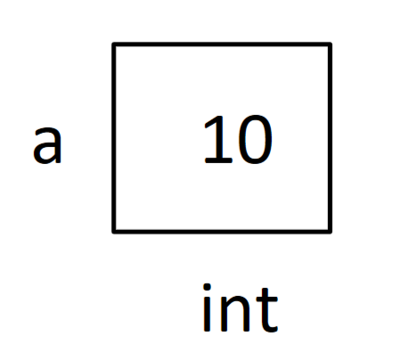
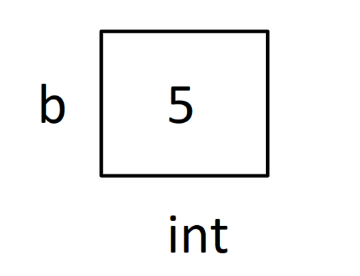

# Variables and Constants

## Variables

A variable is a symbol that represents a storage location in the computer's memory. The information stored in that location is called the **value** of the variable.

One common way for a variable to obtain a value is by an **assignment**, with the syntax:

```cpp
variable = expression;
```

First the *expression* is evaluated, and then the resulting value is assigned to the *variable*. The equals sign `=` is the **assignment operator** in C++.

## Declaration

Every variable in a C++ program must be declared before it is used. The syntax is:

```cpp
specifier type name = initializer
```

where:

- *specifier* is an **optional** keyword such as `const`,
- *type* is one of the C++ data types such as `int`,
- *name* is the name of the variable,
- *initializer* is an optional initialization clause such as `44`.

The purpose of a declaration is to introduce a name to the program, that is, to explain to the compiler what the name means. The *type* tells the compiler what **range of values** the variable may have and what **operations** can be performed on it.

Example:

```cpp
int a;      // this is called declaration
a = 10;     // this is called assignment
int b = 5;  // this is called initialization
```

Think of `a` and `b` as containers. The value is what is stored in the container, and `int` tells what type of thing is stored in the container (for example 10 is an integer).

- `a` is created without any value (declaration).
- `10` is assigned as the value of `a` (assignment).
- `b` is created with `5` as its value (initialization).










See also [Primitive Data Types](primitive-data-types.md) and, for the JavaScript view, [Variables](../javascript/variables.md).

## Practice Questions

??? question "1. What is a variable?"

    A symbol that represents a storage location in the computer's memory. The information stored there is the variable's value.

??? question "2. What is the difference between declaration, assignment, and initialization?"

    Declaration creates the variable with a type but no value (`int a;`). Assignment gives an existing variable a value (`a = 10;`). Initialization declares the variable and gives it a value at the same time (`int b = 5;`).

??? question "3. What does the type tell the compiler?"

    What range of values the variable may have and what operations can be performed on it.

??? question "4. What is the syntax of a declaration, and which parts are optional?"

    `specifier type name = initializer`. The specifier (such as `const`) and the initializer are optional.

??? question "5. What is the assignment operator in C++, and in what order does an assignment happen?"

    The equals sign `=`. The expression on the right is evaluated first, and the resulting value is then assigned to the variable.
