# Docker

## **What is Docker?**

Docker is a **containerization platform** that packages applications and their dependencies into **containers**, ensuring they run the same everywhere.

### The Problem Before Docker

Imagine you cooked a meal at home (your app) and it worked perfectly in your kitchen (your computer). But when you give the same ingredients and instructions to a friend (a different computer), it doesn’t taste the same—maybe they have a different stove or missing ingredients.

### **How Docker Solves This**

Docker **packages everything** your app needs (code, settings, dependencies) into a **container**—just like a lunchbox. This way:

✅ Works the same on any system (PC, server, cloud)

✅ No dependency issues

✅ Easy to deploy and scale applications

### **Key Concepts:**

- **Docker Image** → A template with app & dependencies (like a recipe)
- **Docker Container** → A running instance of an image (like a prepared meal)
- **Docker Hub** → A repository to store and share images

### **Basic Commands:**

- `docker build -t myapp .` → Create an image
- `docker run -d -p 8080:8080 myapp` → Run a container
- `docker ps` → List running containers
- `docker stop <container_id>` → Stop a container

### **Why Docker Can't Run Natively on Windows (without WSL2/Hyper-V):**

- **Kernel Dependencies**: Docker relies on **Linux-specific kernel features** that Windows doesn't support natively.
    - **Linux Namespaces** and **Cgroups** are crucial for process isolation and resource management, and they require a Linux kernel to function.
    - Chroot & Seccomp and UnionFS
    - Windows doesn't have these features built-in, which is why Docker can't run directly on Windows like it does on Linux.

### **Union File System (UnionFS)**

A **Union File System** (UnionFS) is a **filesystem** that allows **multiple filesystems to be mounted** (combined) in a way that they appear as a single filesystem. It is a **layered filesystem**, meaning it can stack multiple layers of data and make them accessible as one unified directory structure.

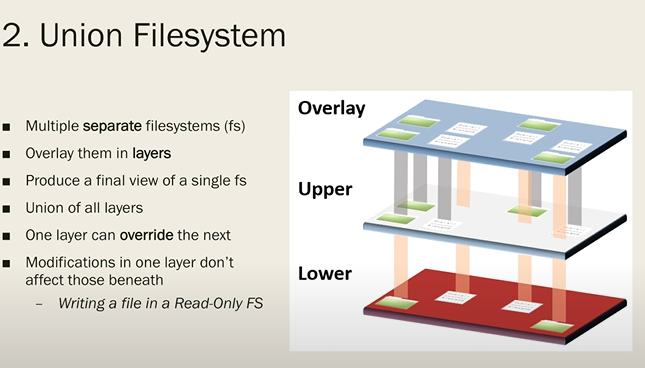

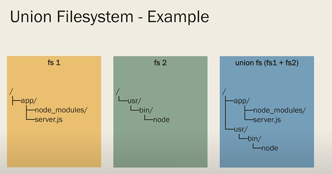

#### **How UnionFS Works in Docker:**

In Docker, **UnionFS** is used to create the **layers** of Docker images.

- Each **Docker image** consists of multiple **layers** that represent the different components of the application (like the base operating system, installed dependencies, and your application code).
- These layers are stacked on top of each other using UnionFS. The **bottom-most layer** is the base (like an OS image), and the top-most layers are your changes (like app code or configurations).

### Docker Engine

**Docker Engine** is the core component that enables the creation, running, and management of containers. It is essentially the **runtime environment** for Docker containers, which handles building, running, and orchestrating containers.

#### 1. dockerd

server that manages(such as starting, stopping, and building containers) Docker object via API request

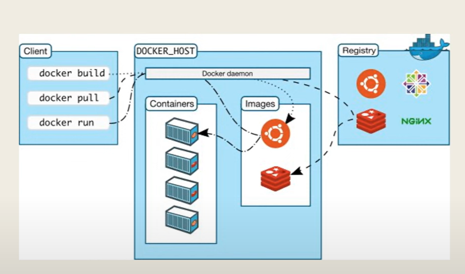

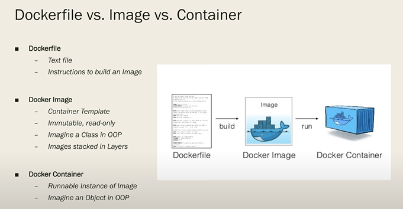

### Optimizing Docker file

1. Alpine: Why? BusyBox, musl libc, apk (no cache)
2. Official Images
3. Explicit Image versions 
    
    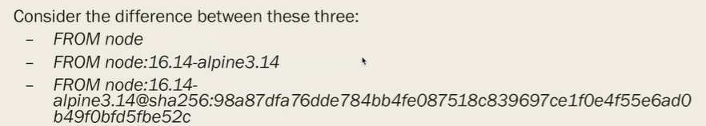
    
4. Design in Layers: top the less frequently run toward the bottom 
5. Multi-Stage builds: copy the artifact from earlier stages to the later stages (for example copying only the executable of c after compiling and everything into the next stage)
    
    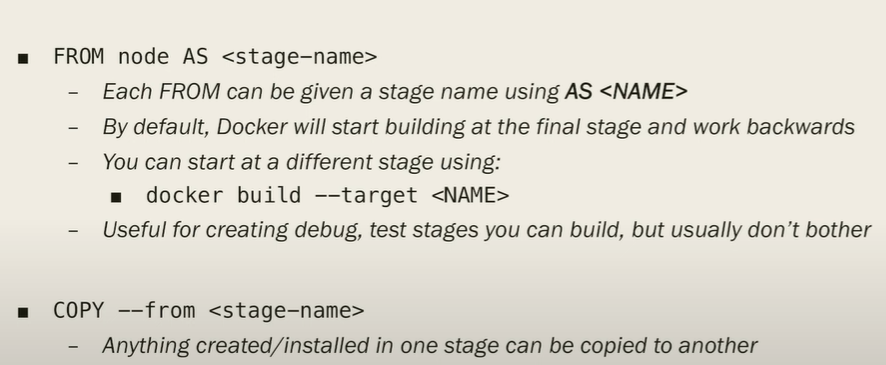
    
    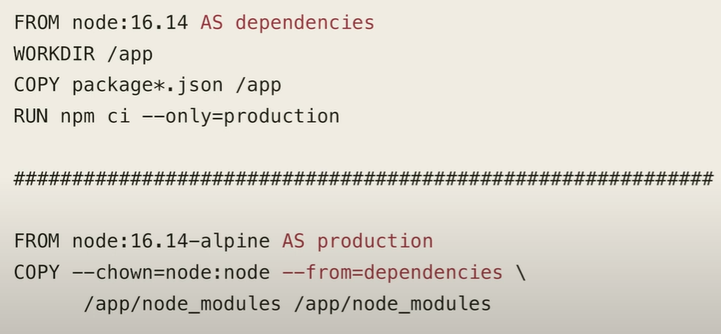
    
6. Development vs. Production
    
    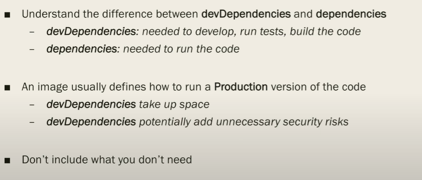
    
7. User
    
    need root privileges: Installing dependencies etc.
    
    Principle of least Privilege
    
    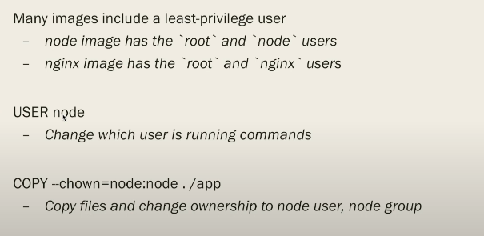
    
    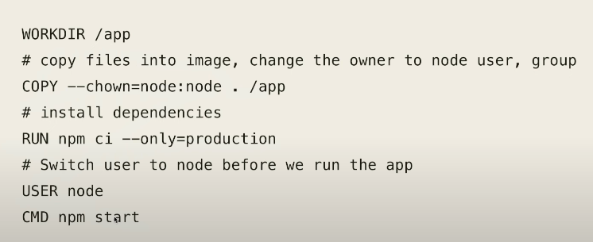
    
8. Better init process
    
    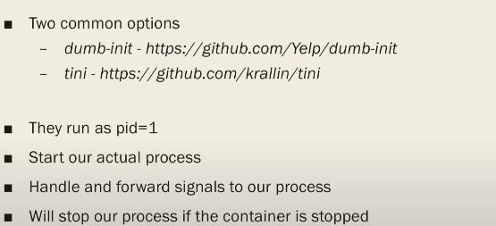
    
9. Health  Check
    
    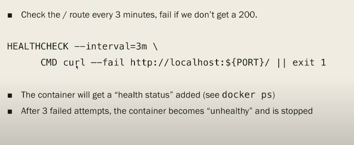
    

Summary:

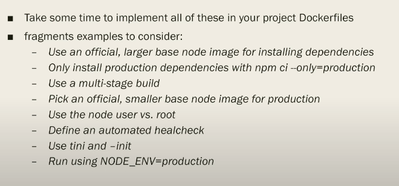

## Practice Questions

??? question "1. What is Docker?"

    A containerization platform that packages an application and its dependencies into containers, so it runs the same everywhere.

??? question "2. What problem does Docker solve?"

    It works on my machine but not on yours: differences in stove or missing ingredients in the cooking analogy. A container packages code, settings, and dependencies together, like a lunchbox.

??? question "3. What is the difference between an image, a container, and Docker Hub?"

    An image is a template with the app and its dependencies (a recipe). A container is a running instance of an image (a prepared meal). Docker Hub is a repository to store and share images.

??? question "4. What do docker build, run, ps, and stop do?"

    `docker build -t myapp .` creates an image. `docker run -d -p 8080:8080 myapp` runs a container. `docker ps` lists running containers. `docker stop <container_id>` stops one.

??? question "5. Why can't Docker run natively on Windows without WSL2 or Hyper-V?"

    It relies on Linux-specific kernel features (namespaces, cgroups, chroot, seccomp, UnionFS) that Windows doesn't have built in.

??? question "6. What is a union file system and how does Docker use it?"

    A layered filesystem that combines multiple filesystems so they appear as one. Docker images are stacks of layers (base OS, dependencies, app code) with the base at the bottom and your changes on top.

??? question "7. Name some ways to optimize a Dockerfile."

    Use Alpine, official images, and explicit image versions; order layers with the least frequently changing at the top; use multi-stage builds; separate development from production; run as a non-root user (least privilege); use a better init process; add a health check.
