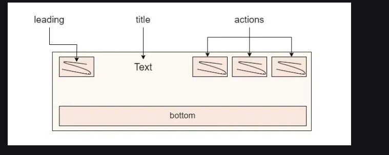
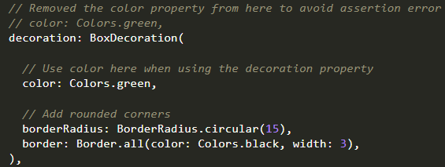

# Flutter

!!! tip

    keep code DRY (Don’t Repeat Yourself)

    `CTRL + .` to open the menu to wrap the widget with other widgets

    even if need to convert our widget from stateless to statefule, just go to the class name and press ctrl + .

## Installations

Steps : [https://docs.flutter.dev/get-started/install/windows/mobile](https://docs.flutter.dev/get-started/install/windows/mobile)

- Android studio
- Git
- Visual Studio code
- Flutter extension in VS code
- Download SDK if it says
- Command line tools ([https://developer.android.com/studio#command-tools](https://developer.android.com/studio#command-tools)) scroll all the way down you will find there 
Command-line-tools/latest/
- download java
- create variable JAVA_HOME add it
- Create Project
    
    `flutter create --org [com.pg](http://com.pg/) ourmoments`
    
    `flutter docker`
    
- install these four:

```
 firebase_core: ^3.13.0
  cloud_firestore: ^5.6.7
  firebase_analytics: ^11.4.5
  firebase_auth: ^5.5.3
```

`dart pub global activate flutterfire_cli`

Follow the instructions on screen to add the path

`npm install -g firebase-tools` 

Create the project in the firebase console first and then run this command

`flutterfire configure`         

### error

#### The error indicates that the Groovy compiler is encountering an issue due to an unsupported Java version (`Unsupported class file major version 68`). This happens because the Java version being used is newer than what the Gradle version supports. Here's how you can resolve this issue:

Java -version

java version was mismatching

#### ndkVersion and minSdkVersion mismatch

1. **Update the `ndkVersion`** to match the required version by the plugins.
2. **Increase the `minSdkVersion`** to 23 as required by the `firebase_auth` plugin.

added cmdtool in the android sdk to the path

add Java to path

flutter clean

flutter pub get

flutter run  ( in android folder)

./gradlew clean

delete the previous emulator

restart the computers multiple times

## Widgets

Everything is a widget!

### Stateless vs Stateful Widgets

**Stateless Widget** - immutable like *statue*

**Stateful Widget** - dynamic like a *flowing river*

## The Flutter Tree

Widgets are arranged in a “tree”, like family tree. The root (App) has branches (Screens), which have leaves (button, text, etc.).

### MaterialApp

- Sets the main **theme** (colors, fonts, etc.)
- Handles **navigation** (which page to show)
- Manages the **app title** (what’s shown in task switcher)
- Sets up the **home screen** (the first thing users see)
- Adds Material Design magic (animations, icons, buttons, etc.)

### Scaffold class

This class expand to occupy the whole available space in device screen.

```dart
Scaffold({
  Key? key,
  PreferredSizeWidget? appBar,
  Widget? body,
  Widget? floatingActionButton,
  FloatingActionButtonLocation? floatingActionButtonLocation,
  FloatingActionButtonAnimator? floatingActionButtonAnimator,
  List<Widget>? persistentFooterButtons,
  Widget? drawer,
  DrawerCallback? onDrawerChanged,
  Widget? endDrawer,
  DrawerCallback? onEndDrawerChanged,
  Widget? bottomNavigationBar,
  Widget? bottomSheet,
  Color? backgroundColor,
  bool? resizeToAvoidBottomInset,
  bool primary = true,
  DragStartBehavior drawerDragStartBehavior = DragStartBehavior.start,
  bool extendBody = false,
  bool extendBodyBehindAppBar = false,
  Color? drawerScrimColor,
  double? drawerEdgeDragWidth,
  bool drawerEnableOpenDragGesture = true,
  bool endDrawerEnableOpenDragGesture = true,
  String? restorationId,
})
```

??? note "Code"
    
    ```dart
    import 'package:flutter/material.dart';
    import 'package:flutter/gestures.dart';
    
    void main() {
      runApp(MyApp());
    }
    
    class MyApp extends StatelessWidget {
      @override
      Widget build(BuildContext context) {
        return MaterialApp(
          title: 'Scaffold Example',
          theme: ThemeData(primarySwatch: Colors.teal),
          home: MyHomePage(),
          restorationScopeId: 'main',
        );
      }
    }
    
    class MyHomePage extends StatefulWidget {
      @override
      State<MyHomePage> createState() => _MyHomePageState();
    }
    
    class _MyHomePageState extends State<MyHomePage>
        with SingleTickerProviderStateMixin, RestorationMixin {
      final RestorableInt _tabIndex = RestorableInt(0);
      TabController? _tabController;
    
      @override
      String? get restorationId => 'home_page';
    
      @override
      void restoreState(RestorationBucket? oldBucket, bool initialRestore) {
        registerForRestoration(_tabIndex, 'tab_index');
        _tabController?.dispose(); // Dispose old controller if any
        _tabController = TabController(
          length: 3,
          vsync: this,
          initialIndex: _tabIndex.value,
        );
        _tabController!.addListener(() {
          setState(() {
            _tabIndex.value = _tabController!.index;
          });
        });
        setState(() {}); // Rebuild after controller is ready
      }
    
      @override
      void dispose() {
        _tabController?.dispose();
        _tabIndex.dispose();
        super.dispose();
      }
    
      void _openDrawer() => Scaffold.of(context).openDrawer();
    
      @override
      Widget build(BuildContext context) {
        if (_tabController == null) {
          // Show a placeholder while controller is not ready
          return const SizedBox.shrink();
        }
        return Scaffold(
          appBar: AppBar(
            title: Text('Scaffold Demo'),
            centerTitle: true,
            actions: [
              IconButton(
                icon: Icon(Icons.notifications),
                onPressed:
                    () => ScaffoldMessenger.of(context).showSnackBar(
                      SnackBar(content: Text('Notifications clicked!')),
                    ),
              ),
            ],
            bottom: TabBar(
              controller: _tabController,
              tabs: [
                Tab(icon: Icon(Icons.home), text: "Home"),
                Tab(icon: Icon(Icons.star), text: "Favorites"),
                Tab(icon: Icon(Icons.settings), text: "Settings"),
              ],
            ),
          ),
          body: TabBarView(
            controller: _tabController,
            children: [
              Center(child: Text("Home Page")),
              Center(child: Text("Favorites Page")),
              Center(child: Text("Settings Page")),
            ],
          ),
          drawer: Drawer(
            child: ListView(
              children: [
                DrawerHeader(
                  decoration: BoxDecoration(color: Colors.teal),
                  child: Text(
                    'Drawer Header',
                    style: TextStyle(color: Colors.white, fontSize: 24),
                  ),
                ),
                ListTile(
                  leading: Icon(Icons.home),
                  title: Text('Home'),
                  onTap: () => Navigator.pop(context),
                ),
                ListTile(
                  leading: Icon(Icons.star),
                  title: Text('Favorites'),
                  onTap: () => Navigator.pop(context),
                ),
              ],
            ),
          ),
          onDrawerChanged: (isOpened) {
            debugPrint("Drawer is ${isOpened ? "opened" : "closed"}");
          },
          endDrawer: Drawer(child: Center(child: Text('End Drawer'))),
          onEndDrawerChanged: (isOpened) {
            debugPrint("End Drawer is ${isOpened ? "opened" : "closed"}");
          },
          floatingActionButton: FloatingActionButton(
            onPressed:
                () => ScaffoldMessenger.of(
                  context,
                ).showSnackBar(SnackBar(content: Text('FAB Pressed!'))),
            tooltip: 'Add',
            child: Icon(Icons.add),
          ),
          floatingActionButtonLocation: FloatingActionButtonLocation.endDocked,
          floatingActionButtonAnimator: FloatingActionButtonAnimator.scaling,
          persistentFooterButtons: [
            TextButton(onPressed: () {}, child: Text("Footer 1")),
            TextButton(onPressed: () {}, child: Text("Footer 2")),
          ],
          bottomNavigationBar: BottomAppBar(
            shape: CircularNotchedRectangle(),
            color: Colors.teal[200],
            child: Row(
              mainAxisAlignment: MainAxisAlignment.spaceAround,
              children: [
                IconButton(icon: Icon(Icons.menu), onPressed: _openDrawer),
                IconButton(icon: Icon(Icons.search), onPressed: () {}),
              ],
            ),
          ),
          bottomSheet: Container(
            color: Colors.teal[50],
            height: 40,
            alignment: Alignment.center,
            child: Text("Bottom Sheet Area"),
          ),
          backgroundColor: Colors.grey[100],
          resizeToAvoidBottomInset: true,
          primary: true,
          drawerDragStartBehavior: DragStartBehavior.start,
          drawerScrimColor: Colors.black54,
          drawerEdgeDragWidth: 40,
          drawerEnableOpenDragGesture: true,
          endDrawerEnableOpenDragGesture: true,
          extendBody: false,
          extendBodyBehindAppBar: false,
          restorationId: 'scaffold',
        );
      }
    }
    
    ```
    

### AppBar WIdget

***AppBar*** is usually the topmost component of the app 



```dart
AppBar AppBar({
  Key? key,
  Widget? leading,
  bool automaticallyImplyLeading = true,
  Widget? title,
  List<Widget>? actions,
  Widget? flexibleSpace,
  PreferredSizeWidget? bottom,
  double? elevation,
  double? scrolledUnderElevation,
  bool Function(ScrollNotification) notificationPredicate = defaultScrollNotificationPredicate,
  Color? shadowColor,
  Color? surfaceTintColor,
  ShapeBorder? shape,
  Color? backgroundColor,
  Color? foregroundColor,
  IconThemeData? iconTheme,
  IconThemeData? actionsIconTheme,
  bool primary = true,
  bool? centerTitle,
  bool excludeHeaderSemantics = false,
  double? titleSpacing,
  double toolbarOpacity = 1.0,
  double bottomOpacity = 1.0,
  double? toolbarHeight,
  double? leadingWidth,
  TextStyle? toolbarTextStyle,
  TextStyle? titleTextStyle,
  SystemUiOverlayStyle? systemOverlayStyle,
  bool forceMaterialTransparency = false,
  Clip? clipBehavior,
})
```

## Container class

```dart
Container(
  width: 120,                        // width of the box
  height: 120,                       // height of the box
  color: Colors.amber,               // background color
  margin: EdgeInsets.all(20),        // space outside
  padding: EdgeInsets.symmetric(horizontal: 10, vertical: 5), // space inside
  alignment: Alignment.center,       // position child in center
  decoration: BoxDecoration( // behind the child
    border: Border.all(color: Colors.red, width: 2),        // border around box
    borderRadius: BorderRadius.circular(15),                // rounded corners
    boxShadow: [BoxShadow(color: Colors.black26, blurRadius: 5)], // shadow
  ),
  foregroundDecoration: BoxDecoration( // on top of the child
    border: Border.all(color: Colors.green, width: 1),      // border on top
  ),
  constraints: BoxConstraints(
    minWidth: 100,
    maxHeight: 150,
  ),
  transform: Matrix4.rotationZ(0.05), // slight rotation
  clipBehavior: Clip.hardEdge,         // clip overflow
  child: Text('Hello, Flutter!'),      // the content inside
)
```

!!! tip

    - Child should be at the end
    - We cannot use *color* and *decoration* together if we want we have to use *color* inside *decoration*

        

### Animated containers

??? note "Code"
    
    ```dart
    import 'package:flutter/material.dart';
    
    void main() {
      runApp(const MyApp());
    }
    
    class MyApp extends StatelessWidget {
      const MyApp({super.key});
    
      // This widget is the root of your application.
      @override
      Widget build(BuildContext context) {
        return MaterialApp(
          home: Scaffold(
            appBar: AppBar(title: const Text('Flutter Demo')),
            body: const MyAnimatedContainer(),
          ),
        );
      }
    }
    
    class MyAnimatedContainer extends StatefulWidget {
      const MyAnimatedContainer({super.key}); // Add const constructor
    
      @override
      State<MyAnimatedContainer> createState() => _MyAnimatedContainerState();
    }
    
    class _MyAnimatedContainerState extends State<MyAnimatedContainer> {
      double _width = 100;
      double _height = 100;
      Color _color = Colors.blue;
    
      void _changeContainer() {
        setState(() {
          _width = _width == 100 ? 200 : 100;
          _height = _height == 100 ? 200 : 100;
          _color = _color == Colors.blue ? Colors.orange : Colors.blue;
        });
      }
    
      @override
      Widget build(BuildContext context) {
        return Center(
          child: GestureDetector(
            onTap: _changeContainer,
            child: AnimatedContainer(
              width: _width,
              height: _height,
              color: _color,
              duration: Duration(seconds: 1),
              curve: Curves.easeInOut,
              child: Center(
                child: Text(
                  "Tap me!",
                  style: TextStyle(fontSize: 18), // Example style
                ),
              ),
            ),
          ),
        );
      }
    }
    
    ```
    

### Tab View

??? note "Code"
    
    ```dart
    class HomePage extends StatelessWidget {
      const HomePage({super.key});
    
      @override
      Widget build(BuildContext context) {
        return DefaultTabController(
          length: 3,
          child: Scaffold(
            appBar: AppBar(title: Text("Our Moments")),
            body: TabBarView(
              children: [
                Center(child: Icon(Icons.camera)),
                Center(child: Icon(Icons.image)),
                Center(child: Icon(Icons.favorite)),
              ],
            ),
            bottomNavigationBar: ClipRRect(
              borderRadius: const BorderRadius.only(topLeft: Radius.circular(25.0)),
              child: Material(
                color: Theme.of(context).primaryColor,
                child: TabBar(
                  labelColor: Colors.white, // Selected tab text color
                  unselectedLabelColor: Colors.white70, // Unselected tab text color
                  indicatorColor: Colors.white, // Indicator color
                  tabs: [
                    Tab(icon: Icon(Icons.camera_alt_outlined), text: "Camera"),
                    Tab(icon: Icon(Icons.image_outlined), text: "Gallery"),
                    Tab(
                      icon: Icon(Icons.favorite_border_outlined),
                      text: "Favorites",
                    ),
                  ],
                ),
              ),
            ),
          ),
        );
      }
    }
    ```
    

### Page View

??? note "Code"
    
    ```dart
    class MyPageView extends StatefulWidget {
      const MyPageView({super.key});
      @override
      State<MyPageView> createState() => _MyPageViewState();
    }
    
    class _MyPageViewState extends State<MyPageView> {
      PageController controller = PageController();
      final List<Widget> _list = <Widget>[
        Center(child: Pages(text: "Page 1")),
        Center(child: Pages(text: "Page 2")),
        Center(child: Pages(text: "Page 3")),
        Center(child: Pages(text: "Page 4")),
      ];
      int _curr = 0;
    
      @override
      Widget build(BuildContext context) {
        return Scaffold(
          backgroundColor: Colors.grey,
          appBar: AppBar(
            title: Text("GeeksforGeeks"),
            backgroundColor: Colors.green,
            actions: <Widget>[
              Padding(
                padding: const EdgeInsets.all(3.0),
                child: Text(
                  "Page: ${_curr + 1}/${_list.length}",
                  textScaler: TextScaler.linear(2),
                ),
              ),
            ],
          ),
          body: PageView(
            scrollDirection: Axis.horizontal,
    
            // reverse: true,
            // physics: BouncingScrollPhysics(),
            controller: controller,
            onPageChanged: (number) {
              setState(() {
                _curr = number;
              });
            },
            children: _list,
          ),
          floatingActionButton: Row(
            mainAxisAlignment: MainAxisAlignment.spaceEvenly,
            children: <Widget>[
              FloatingActionButton(
                onPressed: () {
                  setState(() {
                    _list.add(
                      Center(
                        child: Text("New page", style: TextStyle(fontSize: 35.0)),
                      ),
                    );
                  });
                  if (_curr != _list.length - 1) {
                    controller.jumpToPage(_curr + 1);
                  } else {
                    controller.jumpToPage(0);
                  }
                },
                child: Icon(Icons.add),
              ),
              FloatingActionButton(
                onPressed: () {
                  _list.removeAt(_curr);
                  setState(() {
                    controller.jumpToPage(_curr - 1);
                  });
                },
                child: Icon(Icons.delete),
              ),
            ],
          ),
        );
      }
    }
    
    class Pages extends StatelessWidget {
      final text;
      const Pages({this.text, super.key});
      @override
      Widget build(BuildContext context) {
        return Center(
          child: Column(
            mainAxisAlignment: MainAxisAlignment.center,
            children: <Widget>[
              Text(
                text,
                textAlign: TextAlign.center,
                style: TextStyle(fontSize: 30, fontWeight: FontWeight.bold),
              ),
            ],
          ),
        );
      }
    }
    
    ```
    

### Adding Custom Fonts

1. Dowload the font from google fonts (for example: [Pacifico](https://fonts.google.com/selection?query=pacifico))
2. Create a *font* folder in root directory
3. Extract the folder and put the *.ttf* file in the *font* folder.
4. add this piece of code  in *pubspec.yaml* file
    
    The highlighted things might already be there. So, no need for it
    
    ```dart
    name: gfgcustomfonts
    description: A new Flutter application.
    publish_to: 'none' 
    version: 1.0.0+1
    
    environment:
      sdk: ">=2.7.0 <3.0.1"
      
    dependencies:
      flutter:
        sdk: flutter
      cupertino_icons: ^0.1.3
    
    dev_dependencies:
      flutter_test:
        sdk: flutter
    
    flutter:
      uses-material-design: true
      fonts:
        - family: Pacifico
          fonts:
            - asset: fonts/Pacifico-Regular.ttf
    ```
    
5. use font like this:
    
    ```dart
    			Text(
                  'Welcome to GFG!',
                  style: TextStyle(
                    fontFamily: 'Pacifico',
                    fontSize: 40.0,
                    color: Colors.green,
                    fontWeight: FontWeight.bold,
                  ), // TextStyle
                ), //  Text
    ```

## Practice Questions

??? question "1. What does everything is a widget mean, and what is the difference between stateless and stateful widgets?"

    The whole UI is built from widgets. A stateless widget is immutable, like a statue. A stateful widget is dynamic, like a flowing river.

??? question "2. What is the Flutter tree?"

    Widgets are arranged like a family tree: the root (App) has branches (Screens), which have leaves (button, text, and so on).

??? question "3. What does MaterialApp set up?"

    The main theme (colors, fonts), navigation, the app title, the home screen, and Material Design features like animations, icons, and buttons.

??? question "4. What does the Scaffold class do?"

    It expands to occupy the whole available screen space and provides places for the app bar, body, drawers, floating action button, bottom navigation bar, and more.

??? question "5. What is the rule about color and decoration on a Container?"

    You can't use `color` and `decoration` together. If you need both, put the color inside the `BoxDecoration`.

??? question "6. How do you add a custom font?"

    Download the font, put the `.ttf` in a `fonts` folder in the project root, declare it under `fonts:` in `pubspec.yaml`, then use `fontFamily` in a `TextStyle`.
