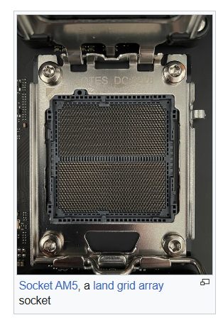
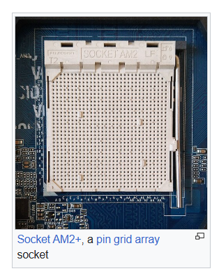

# CPU

## What are two common types of CPU sockets?

Land Grid Array (LGA) and Pin Grid Array (PGA) are two common types of CPU sockets.

See also [Programs, the CPU, and the Memory](programs-cpu-and-memory.md) for how the CPU works with RAM, cache, and the clock.

## Practice Questions

??? question "1. What are two common types of CPU sockets?"

    Land Grid Array (LGA) and Pin Grid Array (PGA).
