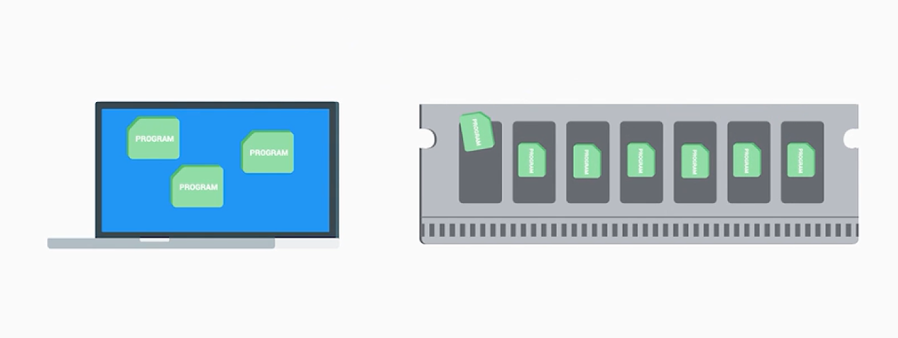
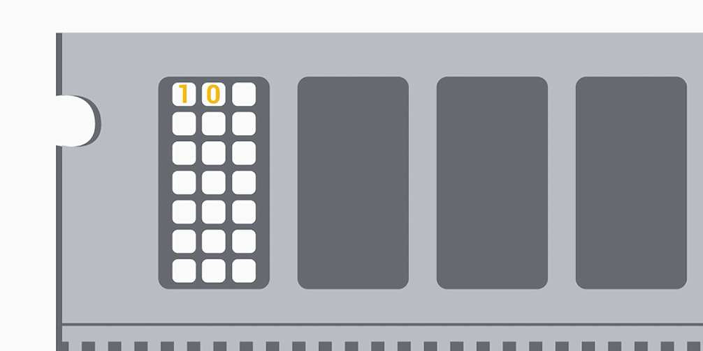

# RAM

RAM is **volatile**: it only holds data while it has power.

To run a program, the computer makes a copy of it in RAM so the CPU can process it. Our hard drive or storage is slow, so we need somewhere faster, which is RAM.

## Types of RAM

### DRAM

Bits are stored as charged capacitors.

Each bit of data in DRAM is stored as a tiny electrical charge inside a microscopic capacitor. Imagine a very small bucket holding water: a full bucket is 1, an empty bucket is 0.

The problem is these buckets have tiny holes, so they slowly leak. In real terms, the charge bleeds away within milliseconds. If nothing intervened, every 1 would gradually turn into a 0 and the data would vanish.

??? note "What refresh means"

    To prevent this, the memory controller periodically goes through every single memory cell, reads its current charge, and if it is supposed to be a 1, tops it back up. This is the **refresh cycle**, and it happens thousands of times per second.

??? note "Why this made early DRAM slow"

    While the system is refreshing cells, it can't read or write new data at the same time. So the CPU would sometimes ask for data and RAM would essentially say "hold on, I'm refreshing right now", causing a small delay called a **wait state**.

    In early DRAM this was a significant bottleneck. Modern DDR RAM still refreshes, but engineers have gotten very good at hiding and minimizing that delay, using smarter timing, dedicated refresh circuits, and better coordination with the CPU.

??? note "The dynamic in the name"

    This constant need to actively maintain the charge is exactly why it is called **Dynamic** RAM: the data isn't passively sitting there stable, it requires ongoing active effort to keep it intact. This contrasts with **SRAM** (Static RAM), used in CPU caches, which holds its charge without refreshing but is far more expensive and physically larger, which is why it is only used in small amounts close to the processor.

    

## DIMM sticks

**DRAM chips** are the tiny black memory chips that actually store your data. They need to be mounted onto a circuit board so they can connect to the motherboard. That circuit board is called a **memory stick** (or memory module).

??? note "DIMM (Dual Inline Memory Module)"

    DIMM is the name of the modern standard type of that circuit board:

    - **Dual**: there are electrical connectors (pins) on both sides of the stick.
    - **Inline**: the pins on each side are arranged in a straight line.
    - **Memory Module**: it is a removable module that holds memory chips.

**Different sizes of pins.** Different generations of RAM (DDR3, DDR4, DDR5) have a different number of pins on their DIMM sticks. For example:

- DDR3 has 240 pins
- DDR4 has 288 pins
- DDR5 has 288 pins (but arranged differently)

This is actually a feature: it physically prevents you from accidentally inserting the wrong generation into your motherboard. The slot simply won't fit.

## Why early DRAM was asynchronous

Early DRAM was built in an era when computers were much simpler and slower. The CPU would send a request to RAM and then wait, checking "is the data ready yet?" until RAM finally responded.

RAM operated on its own internal timing: it would receive the request, do its thing at its own pace, and signal back when done. There was no shared rhythm between them. This is what **asynchronous** means: they weren't working to the same beat.

Think of two people texting each other. You send a message and wait however long it takes for a reply. There's no agreed schedule: the other person responds whenever they're ready.

## SDRAM

SDRAM plugged into the shared motherboard clock. Now both the CPU and RAM listen to the same metronome. This meant:

- The CPU knew exactly which clock tick the data would arrive on.
- RAM knew exactly when to expect a request.
- No more waiting and guessing: everything happened on a predictable schedule.

## DDR SDRAM

DDR SDRAM (Double Data Rate) was the big leap. Instead of transferring data only on one edge of the clock pulse, DDR transfers data on both the rising and falling edges, effectively doubling throughput without increasing the clock speed.

DDR1 through DDR4: each generation brought higher speeds, lower voltage (so less heat and power draw), and larger maximum capacities. DDR4 operates at 1.2V compared to DDR1's 2.5V, while being many times faster.

**The compatibility piece.** This is where people often get tripped up when upgrading. Three things must align:

1. The physical connector. The notch on a DDR4 stick is in a different position than DDR3, so they literally can't be inserted wrong.
2. The generation supported by your motherboard. You can't mix generations.
3. The speed rating. If your motherboard supports up to DDR4-2666, a faster DDR4-3200 stick will work but only run at 2666.

## Practice Questions

??? question "1. What does it mean that RAM is volatile?"

    It only holds data while it has power.

??? question "2. How does DRAM store a bit, and why does it need refreshing?"

    As a tiny electrical charge in a capacitor (charged is 1, empty is 0). The charge leaks away within milliseconds, so the memory controller must periodically read each cell and top the charge back up, thousands of times per second.

??? question "3. What is a wait state?"

    A small delay that happened when the CPU asked for data while RAM was busy refreshing cells and couldn't read or write at the same time.

??? question "4. What is the difference between DRAM and SRAM?"

    SRAM (Static RAM) holds its charge without refreshing but is far more expensive and larger, so it is used in small amounts as CPU cache. DRAM (Dynamic RAM) needs constant active refreshing.

??? question "5. What does DIMM stand for and what do the words mean?"

    Dual Inline Memory Module: connector pins on both sides (dual), arranged in a straight line (inline), on a removable module that holds memory chips.

??? question "6. What is the difference between asynchronous DRAM and SDRAM?"

    Asynchronous DRAM ran on its own internal timing with no shared rhythm with the CPU. SDRAM is synchronized to the motherboard clock, so both know exactly when data will arrive.

??? question "7. What did DDR change?"

    It transfers data on both the rising and falling edges of the clock pulse, doubling throughput without raising the clock speed.

??? question "8. What three things must line up when upgrading RAM?"

    The physical connector, the generation supported by the motherboard, and the speed rating (a faster stick runs at the motherboard's maximum supported speed).
