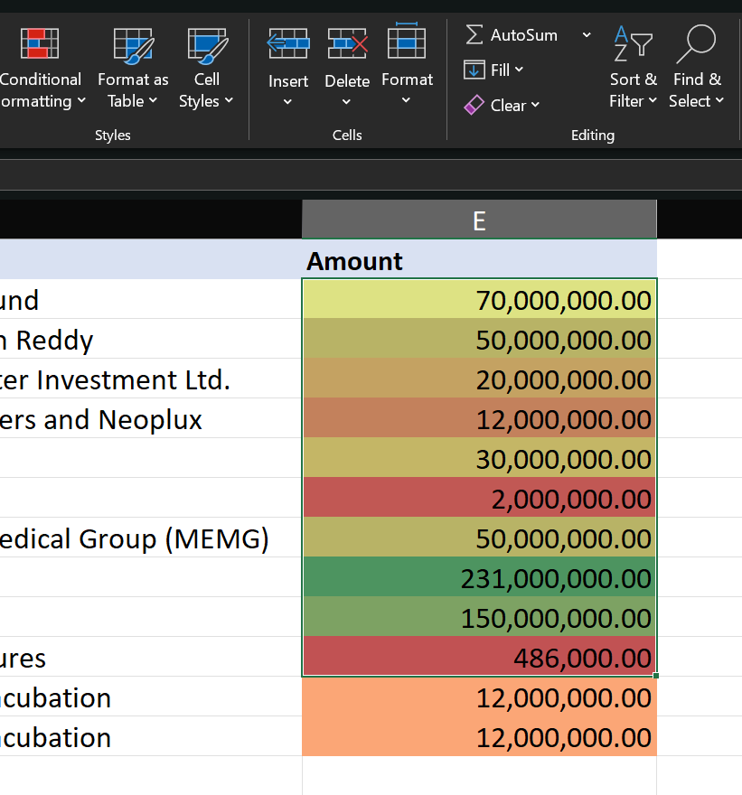

# Conditional Formatting

## Practice Questions

??? question "1. What does conditional formatting do?"

    Formats cells automatically based on their values, for example a color scale on the Amount column from red (low) to green (high).

??? question "2. Where is it in the ribbon?"

    On the Home tab, in the Styles group.
