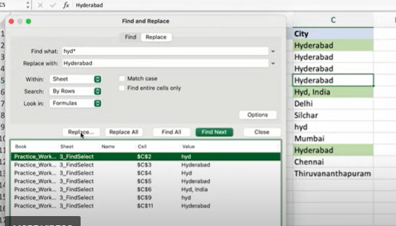

# Find and Select

## Practice Questions

??? question "1. How do you replace many variations of a value at once?"

    Use Find and Replace with a wildcard, for example find `hyd*` and replace with `Hyderabad`, then Replace or Replace All.

??? question "2. What options does Find and Replace have?"

    Search within the sheet, search by rows, look in formulas, match case, and match entire cell contents.
