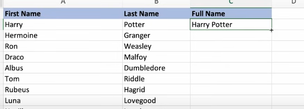
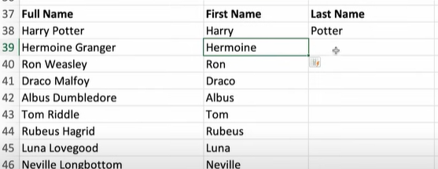

# Flash Fill

select the cell and double click at the corner

CTRL + E short cut for flash fill

We can also extract data from the column

split data:

## Practice Questions

??? question "1. How do you use Flash Fill?"

    Select the cell and double-click the corner, or press Ctrl+E.

??? question "2. What can Flash Fill do?"

    Combine columns (first and last name into a full name), extract data from a column, and split data.
