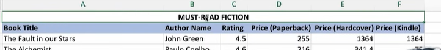

# Home Ribbon

## Copy formatting (Format Painter)

Double-click the Format Painter, then apply the formatting to as many cells as you like. Press Escape when done.

## Wrap text

Use Wrap Text when the text is too long and is hiding behind another column.

## Practice Questions

??? question "1. How do you copy formatting to many cells at once?"

    Double-click the Format Painter, apply the formatting to as many cells as you want, and press Escape when done.

??? question "2. When would you use Wrap Text?"

    When text is too long and is hiding behind another column.
