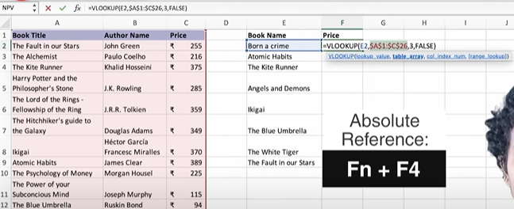

# Lookup Function

## Practice Questions

??? question "1. What does the example VLOOKUP formula mean?"

    `=VLOOKUP(E2,$A$1:$C$26,3,FALSE)` looks up the value in E2 in the first column of the table A1:C26 and returns the value from the 3rd column (Price), with an exact match (FALSE).

??? question "2. How do you make a reference absolute?"

    Press Fn+F4 on the reference, which adds dollar signs like `$A$1:$C$26` so it doesn't shift when copied.
