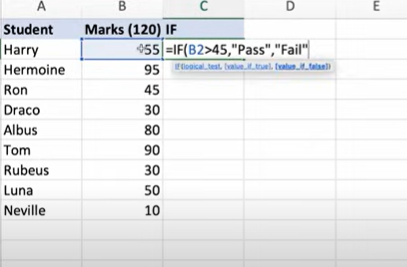
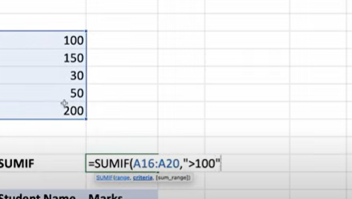

# Relative, Absolute, and Mixed References (and Logical Functions)

AND

OR
SUMIF

COUNTIF

## Practice Questions

??? question "1. What does =IF(B2>45, Pass, Fail) do?"

    Tests whether the mark in B2 is greater than 45 and returns Pass if true and Fail otherwise.

??? question "2. What does SUMIF do?"

    Adds the cells in a range that meet a criterion, for example `=SUMIF(A16:A20,">100")`.

??? question "3. What is COUNTIF for?"

    Counting the cells in a range that meet a criterion.
