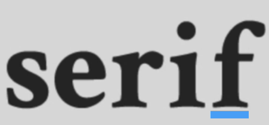
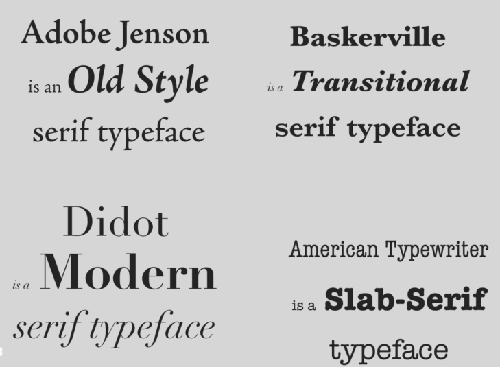
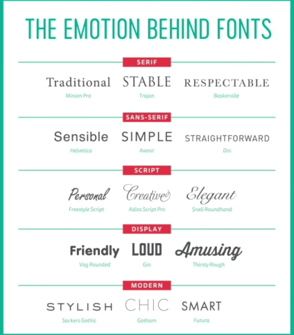
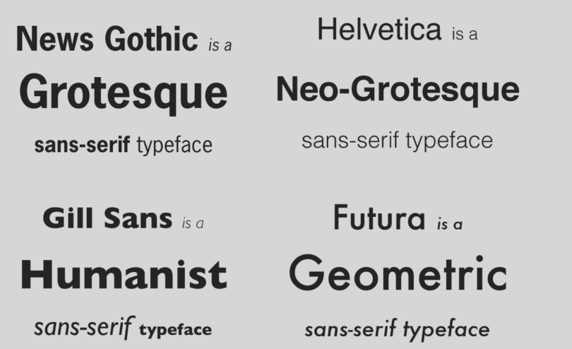
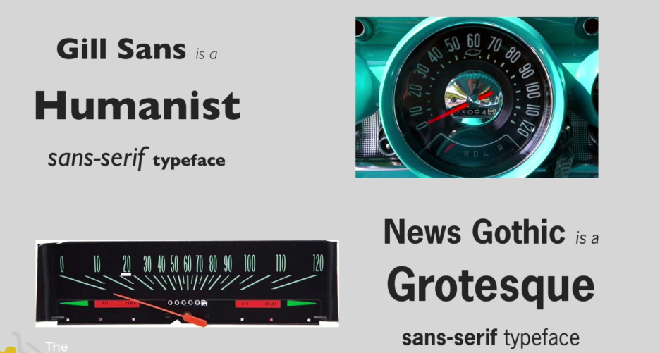
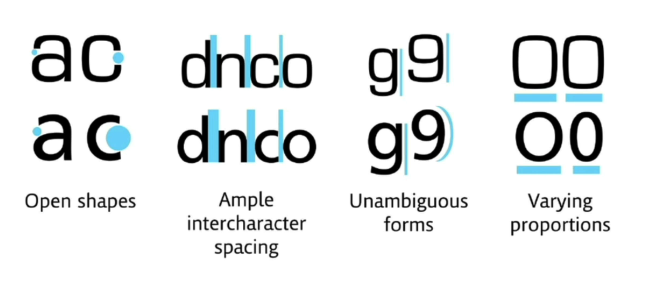
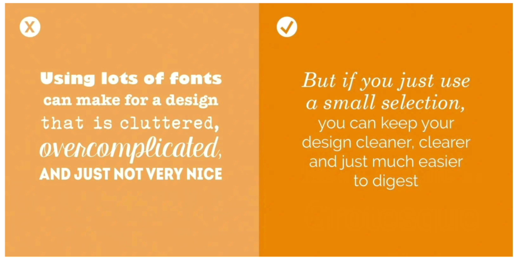
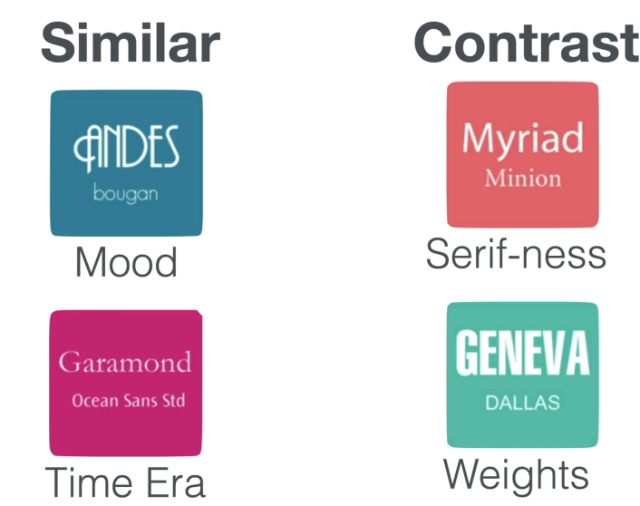

# Typography

## Serif

Makes a design more serious, more authoritative, and old. Suited to a legal company or an architecture magazine.

## Different fonts have different moods

## Sans-serif

The sans-serif font family gives a highly readable, legible typeface.

!!! tip
    An MIT study had users drive a car with the dashboard in a **humanist** typeface and a **grotesque** typeface. They found the humanist typeface could save the driver 30 to 40 percent of the time required to understand information.

    

### When we are looking for legible shapes

## Combining two fonts

!!! tip
    Try to keep fonts to two.

    

    

1. Two different fonts with the same mood
2. A similar time era
3. Contrast, like serif for the body and sans-serif for the heading
4. Increase interest by changing weights

## Practice Questions

??? question "1. What mood does a serif font give a design, and where would you use it?"

    More serious, more authoritative, and old. It suits a legal company or an architecture magazine.

??? question "2. What is a sans-serif font good for?"

    It is a highly readable, legible typeface.

??? question "3. What did the MIT dashboard study find?"

    A humanist typeface saved drivers 30 to 40 percent of the time needed to understand information, compared with a grotesque typeface.

??? question "4. What are the four guidelines for combining two fonts?"

    Choose two fonts with the same mood, from a similar time era, use contrast (serif for the body and sans-serif for the heading), and increase interest by changing weights. Try to keep to two fonts.
