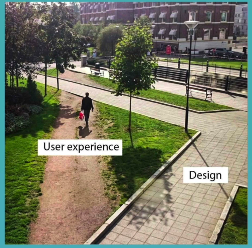
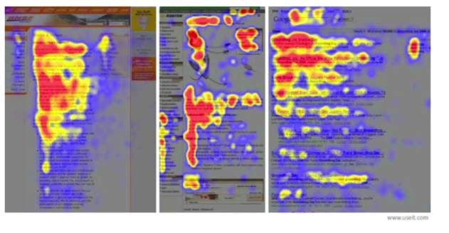
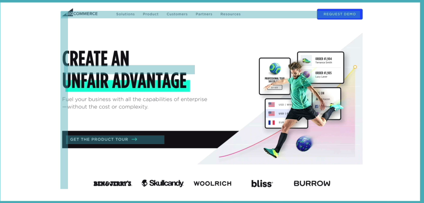
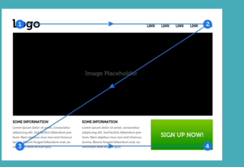

# User Experience (UX) Design

## 1. Simplicity

## 2. Consistency

## 3. Reading patterns

### F layout

### Z layout

## 4. All-platform design

Avoid so many banners that they take most of the space, and don't make the whole website just one part, like one big picture or one piece of text.

## 5. Don't use dark patterns

Dark patterns are trickery that makes you perform an action you don't necessarily want, and you end up feeling disappointed.

## Practice Questions

??? question "1. List the five UX principles in these notes."

    Simplicity, consistency, reading patterns (F layout and Z layout), all-platform design, and not using dark patterns.

??? question "2. What is a dark pattern?"

    Trickery that makes you perform an action you don't necessarily want, and you end up feeling disappointed.

??? question "3. What two mistakes does the all-platform design principle warn against?"

    Using so many banners that they take most of the space, and making the whole website just one part, such as one big picture or one piece of text.
