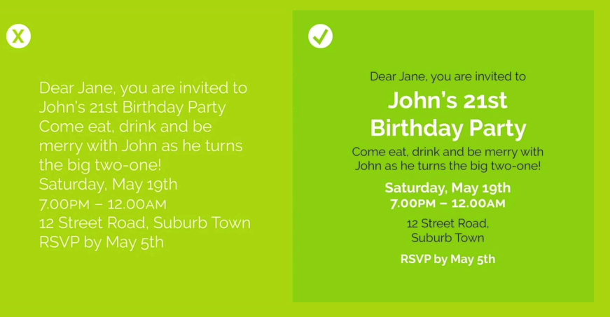
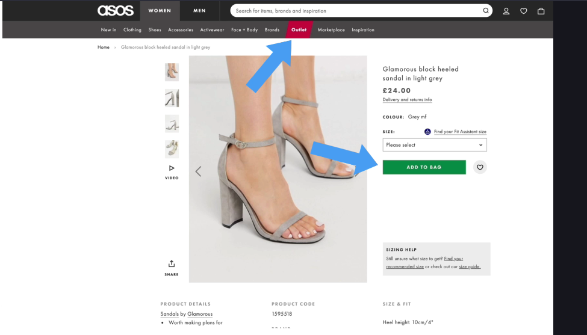
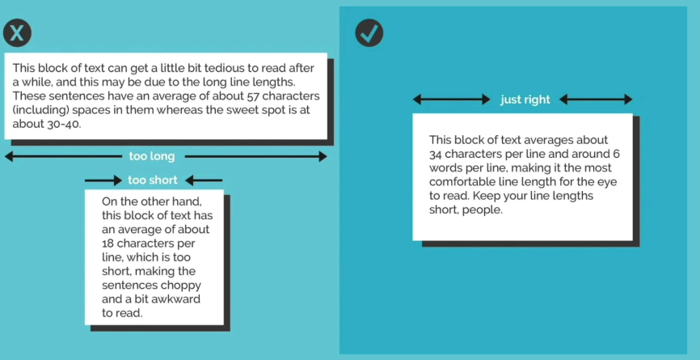
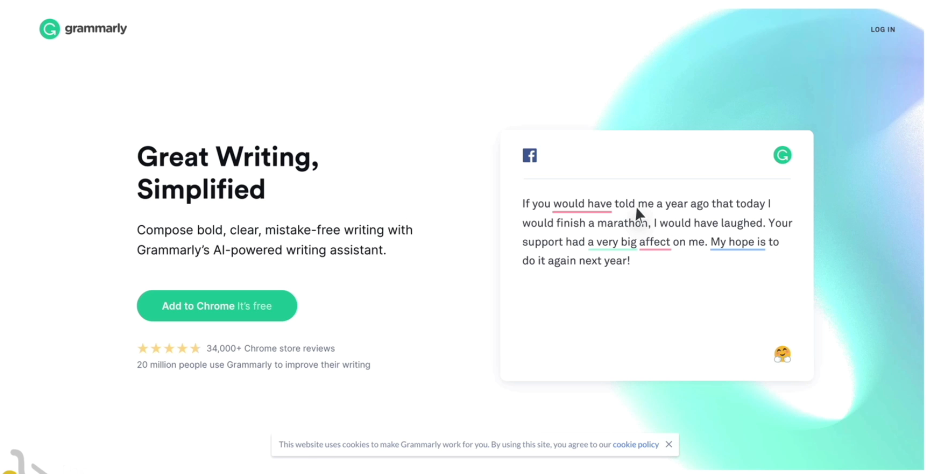
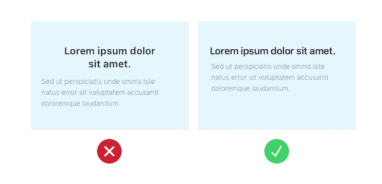
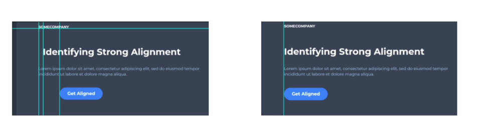
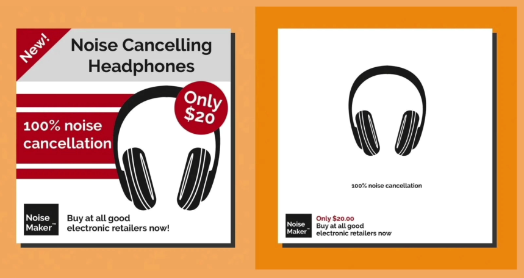
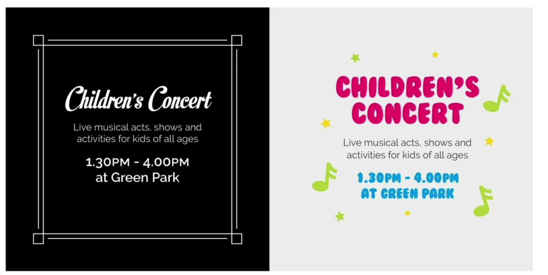

# User Interface Design

## 1. Rule of hierarchy

The most important information should be conveyed first.

In a layout where everything has equal weight, the reader has to go through the entire paragraph.

### Color

Use color to direct the eye. For example, a design can cleverly use green and red to tell the user where to look.

### Size

Use size to show what matters most. In one example, the first thing the site wants to say is that it is for buying and selling cryptocurrency, and the second is to capture the user's email.

## 2. Layout

Compare a bad layout with a good example.

## 3. Alignment

Reduce the number of alignment points.

## 4. Whitespace

Just by introducing whitespace you can make a design look luxurious.

## 5. Audience

Think about what would appeal to the audience and what is important to convey to them.

## Practice Questions

??? question "1. What is the rule of hierarchy?"

    The most important information should be conveyed first. If everything has equal weight, the reader has to go through the whole paragraph.

??? question "2. Which two tools can you use to create hierarchy?"

    Color (for example green and red to draw the eye) and size (the biggest element is what the user notices first).

??? question "3. What does whitespace do for a design?"

    Just by introducing whitespace you can make a design look luxurious.

??? question "4. What advice do the notes give about alignment?"

    Reduce the number of alignment points.

??? question "5. Why does audience matter?"

    You need to think about what would appeal to them and what is important to convey to them, and design for that.
