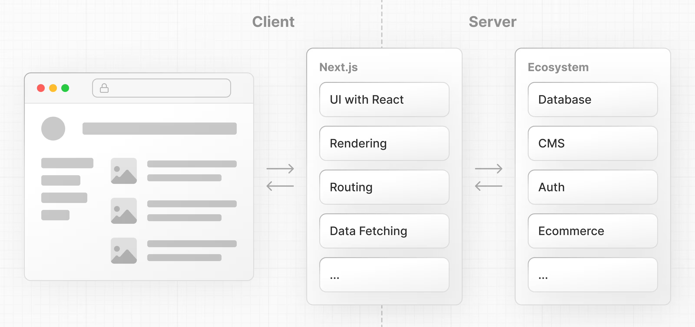
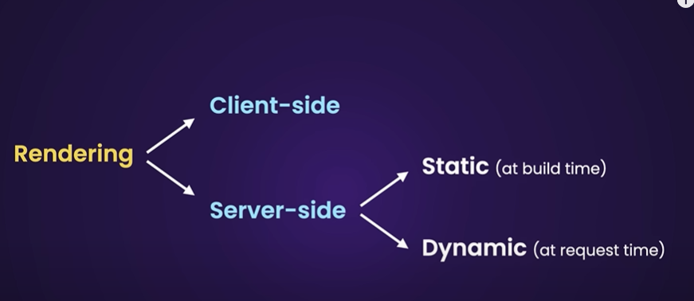

# Next.js

## What is Next.js?

Next.js is a React framework that gives you building blocks to create web applications.

By framework, we mean Next.js handles the tooling and configuration needed for React, and provides additional structure, features, and optimizations for your application.

## Setting up the development environment

- Download the latest Node.js.
- Install a VS Code extension (ES7+ React/Redux ...).

## SSR vs CSR

Reference: [How does SSR (Server-Side Rendering) differ from CSR (Client-Side Rendering)? (GeeksforGeeks)](https://www.geeksforgeeks.org/how-does-ssrserver-side-rendering-differ-from-csrclient-side-rendering/)

Put `'use client'` at the top of a file to make the component client-side rendered (CSR).

## Practice Questions

??? question "1. What is Next.js, and how does it relate to React?"

    A React framework that gives you building blocks for web applications. It handles the tooling and configuration React needs and adds structure, features, and optimizations.

??? question "2. How do you make a component client-side rendered in Next.js?"

    Put `'use client'` at the top of the file.

??? question "3. What two tools do the setup notes list for the development environment?"

    The latest Node.js, and a VS Code extension for React snippets (ES7+ React/Redux).
