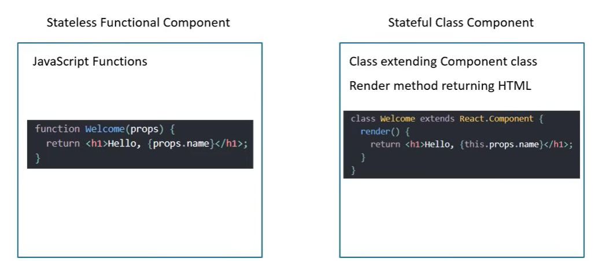
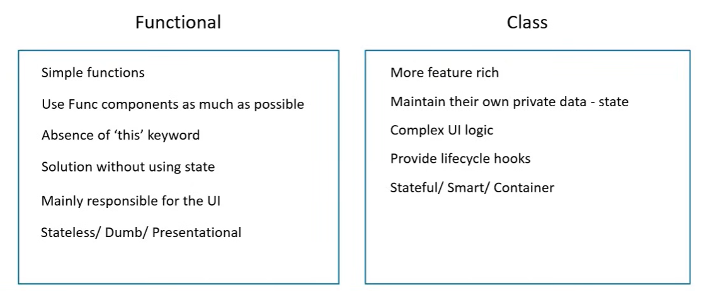

# Components

- Components describe a part of the user interface.
- They are reusable and can be nested inside other components.

## Practice Questions

??? question "1. What does a component describe?"

    A part of the user interface, for example a navigation bar or a footer.

??? question "2. Why are components useful?"

    They are reusable, and they can be nested inside other components, so a page can be built from smaller pieces.
