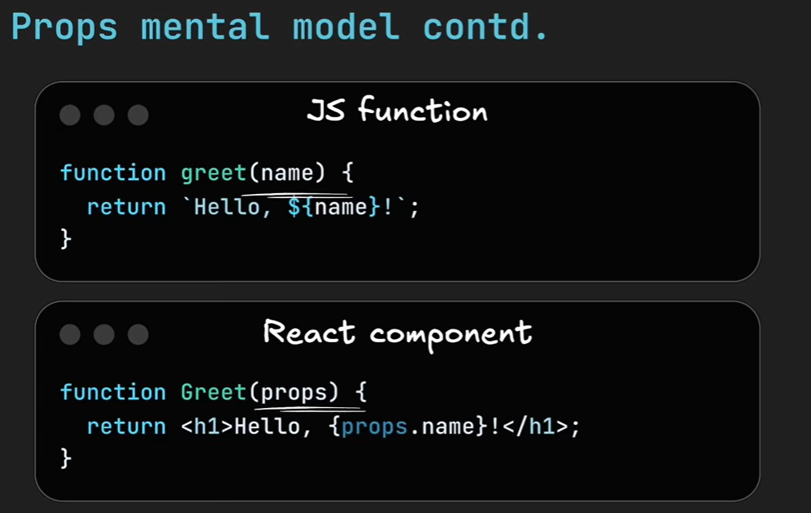
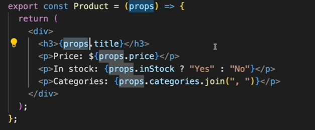
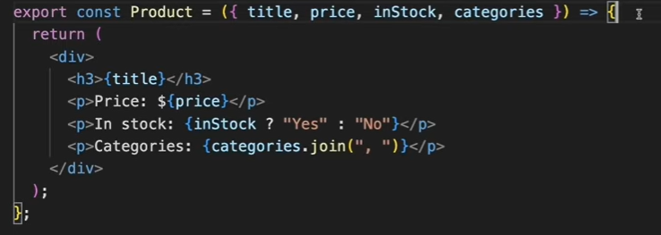

# Props

Props are like arguments you pass to a function

## Javascript Destrcturing Prop

⇒

## Practice Questions

??? question "1. What are props?"

    Values you pass into a component, like arguments you pass to a function.

??? question "2. What is destructuring props?"

    Pulling the individual props out of the props object in the function's parameter list, so you can use them by name.
